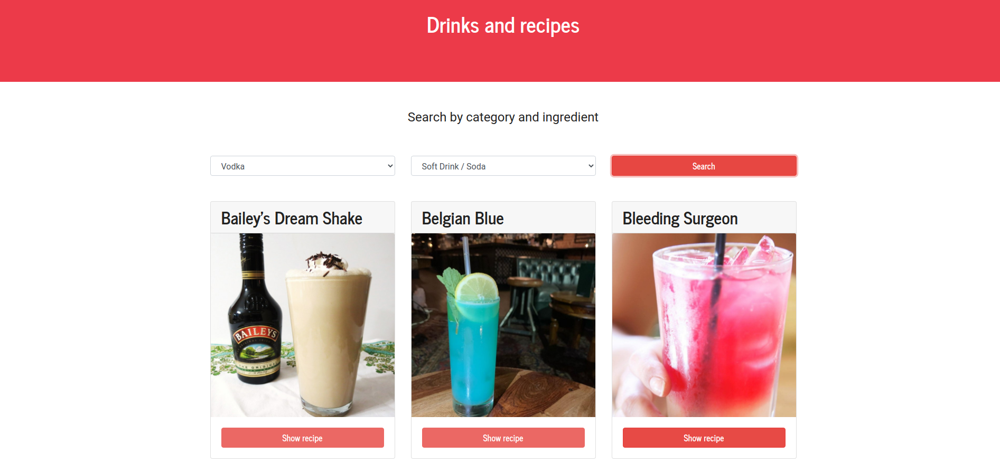

# Drinks and recipes app

## Installation of dependencies

```bash or fish
npm install
```

## Usage

```bash or fish
npm run start
```

## Captures



## Live demo

[here you can try the app](https://peaceful-roentgen-311b67.netlify.app/)